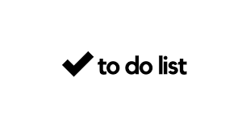
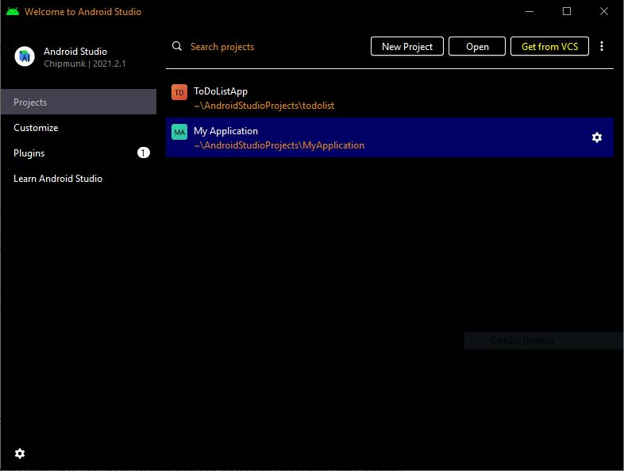
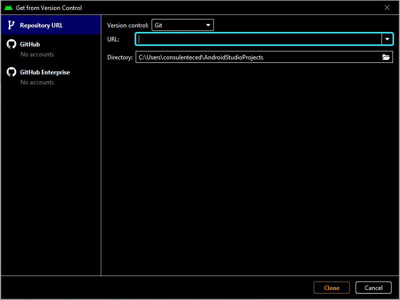
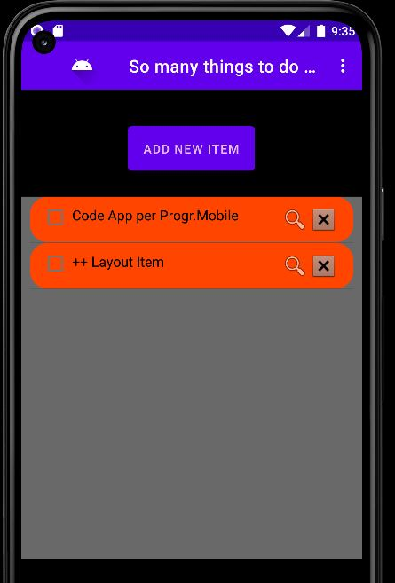
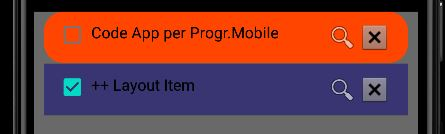
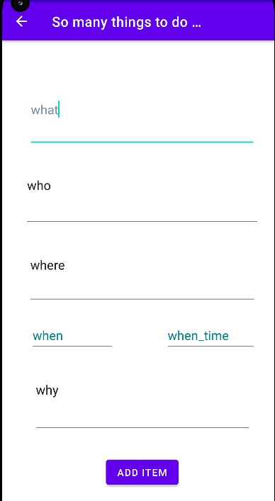

<!--
[![Contributors][contributors-shield]][contributors-url]
[![Forks][forks-shield]][forks-url]
[![Stargazers][stars-shield]][stars-url]
[![Issues][issues-shield]][issues-url]
[![MIT License][license-shield]][license-url]
-->

<!-- PROJECT LOGO -->
 

  

<h3 align="center">TO DO List App for Android</h3>

  

    Una app di esempio per introdurre alla programmazione Mobile per Android in Kotlin
     
    <a href="https://github.com/falistra/todolist"><strong>Espolara la documentazione »</strong></a>
     
     
    <a href="https://github.com/falistra/todolist/issues">Report Bug</a>
    ·
    <a href="https://github.com/falistra/todolist/issues">Desiderata</a>
  

<!-- TABLE OF CONTENTS -->

  
Indice

  <ol>
    <li>
      <a href="#about-the-project">Il progetto</a>
      <ul>
        <li><a href="#built-with">Costruito con</a></li>
      </ul>
    </li>
    <li>
      <a href="#getting-started">Avvio</a>
      <ul>
        <li><a href="#prerequisites">Prerequisiti</a></li>
        <li><a href="#installation">Installazione</a></li>
      </ul>
    </li>
    <li><a href="#usage">Uso</a></li>
    <li><a href="#roadmap">Roadmap</a></li>
    <li><a href="#contributing">Contributing</a></li>
    <li><a href="#license">Licenza</a></li>
    <li><a href="#contact">Contatti</a></li>
    <li><a href="#acknowledgments">Riconoscimenti</a></li>
  </ol>

<!-- ABOUT THE PROJECT -->
## Introduzione

Questa è la mia prima mobile app, usando Android Studio - linguaggio Kotlin.
E' una ennesima variazione della app "TO DO LIST" per gestire una lista di promemoria di "cose da fare".
Ma il vero scopo è quello di esemplificare alcuni aspetti della programmazione mobile:

  <ol>
    <li> Intent espliciti e/o espliciti : p.e. Source: <b>MainActivity.kt</b>   
    <pre>
    <code>    
        val bundle = Bundle()
        for (key in data.keys) {
            bundle.putSerializable(key, data.get(key))
        }
        val intent = Intent(this, ItemInfo::class.java)
        intent.putExtras(bundle)
        startActivity(intent)
    </code>
    </pre>
        Target: <b>ItemInfo.kt</b>  
    <pre>    
<code>
        setContentView(R.layout.activity_item_info)
        val extras : Bundle? = getIntent().getExtras()
        val what = extras?.getString("itemDataText")
</code>
    </pre>
</li>

<li>
class Kotlin per strutturare i dati. P.e. la classe ToDoModel
    <pre>    
<code>
class ToDoModel {
    companion object Factory {
        fun createList() : ToDoModel = ToDoModel()
    }
    var UID : String? = null
    var itemDataText: String? = null
    ...
    var done: Boolean? = false
}
</code>
    </pre>
</li>

<li> Interfaccia a base dati Firebase : p.e. <b>MainActivity.kt</b>   
    <pre>
    <code>    
override fun onItemInfo(itemUID: String) {
    database.child("todo").child(itemUID).get()
        .addOnSuccessListener {
            Log.i("firebase", "Ricevuto valore ${it.child("itemDataText")}")
            val data: Map &lt; String, String &gt; = it.getValue() as HashMap &lt; String, String &gt;
            val bundle = Bundle()
            ...
        }
        .addOnFailureListener{
            Log.e("firebase", "Errore nel ricevere i dati", it)
        }
}
    </code>
    </pre>
</li>

<li>
Usata la Code Convention Standard di Java (pagine 9,10 e 11) del documento in
<a href="http://www.oracle.com/technetwork/java/javase/documentation/codeconvtoc-136057.html">
href="http://www.oracle.com/technetwork/java/javase/documentation/codeconvtoc-136057.html
</a>
</li>

  </ol>

(<a href="#top">back to top</a>)

### Costruito con

L'IDE di sviluppo è : 
<pre>
Android Studio Chipmunk | 2021.2.1 Patch 1
Build #AI-212.5712.43.2112.8609683, built on May 18, 2022
Runtime version: 11.0.12+7-b1504.28-7817840 amd64
VM: OpenJDK 64-Bit Server VM by Oracle Corporation
Windows 10 10.0
GC: G1 Young Generation, G1 Old Generation
Memory: 1280M
Cores: 8
Registry: external.system.auto.import.disabled=true
Non-Bundled Plugins: org.jetbrains.kotlin (212-1.7.0-release-281-AS5457.46)
</pre>

L'IDE può essere scaricato qui:
* [Android Studio](https://developer.android.com/studio)

(<a href="#top">back to top</a>)

<!-- GETTING STARTED -->
## Avvio 

Per ottenere una copia locale attiva e funzionante, 
seguire questi semplici passaggi.

### Installazione

1. Avviare Android Studio

2. Click su <B> Get from VCS </B>
   

3. in <B>HTTP</B> scrivere  <B>https://github.com/falistra/todolist</B>
   
4. Clonare il repo

(<a href="#top">back to top</a>)

<!-- USAGE EXAMPLES -->
## Utilizzo
In apertura l'app presenta una lista di "cose da fare" (in arancione).

 
Per ognuna, oltre a una descrizione, compare a sinistra una checkbox di spunta
per indicare "fatto" : in questo caso cambia il colore di sfondo

 
Alla destra

* una lente, click per aprire una nuova "vista" (activity) di info sull'elemento
* e una checkbox per cancellare l'elemento

Sopra alla lista il bottone con lo sfondo blu
 

 
permette di aggiungere un elemento

(<a href="#top">back to top</a>)

<!-- ROADMAP -->
## Sviluppi successivi

- [x] Lista degli elementi
- [x] Checkbox di spunta per "fatto"
- [x] Aggiunta/Cancellazione di un elemento della lista
- [x] Alert Dialog con info sull'app
- [x] Dati su Firebase
- [x] Supporto multilingue 
    - [x] Italiano
    - [x] Inglese
- [ ] Aggiunta altre info (p.e "chi", "dove")
- [ ] Modifica dei dati di un elemento inserito in precedenza

(<a href="#top">back to top</a>)

<!-- CONTRIBUTING -->
## Contributi

Se hai un suggerimento che lo renderebbe migliore, esegui il fork del repository e crea una richiesta pull. Puoi anche aprire semplicemente un problema con il tag "miglioramento".
Non dimenticare di dare una stella al progetto! Grazie ancora!

1. Fork the Project
2. Create your Feature Branch (`git checkout -b feature/AmazingFeature`)
3. Commit your Changes (`git commit -m 'Add some AmazingFeature'`)
4. Push to the Branch (`git push origin feature/AmazingFeature`)
5. Open a Pull Request

(<a href="#top">back to top</a>)

<!-- LICENSE -->
## Licenza

Distributo sotto licenza MIT License.
Si declina ogni responsabilità nel suo utilizzo.

(<a href="#top">back to top</a>)

<!-- CONTACT -->
## Contatti

Fausto Zanasi - fausto.zanasi@gmail.com

Link al progetto: [https://github.com/falistra/todolist](https://github.com/falistra/todolist)

(<a href="#top">back to top</a>)

<!-- ACKNOWLEDGMENTS -->
## Riconoscimenti

* [Corso di Programmazione Mobile presso  UNIMORE](https://git.hipert.unimore.it/ncapodieci/mobileprogramming/-/wikis/home)
* [Developer Android](https://developer.android.com/)

(<a href="#top">back to top</a>)

<!-- MARKDOWN LINKS & IMAGES -->
<!-- https://www.markdownguide.org/basic-syntax/#reference-style-links -->
[contributors-shield]: https://img.shields.io/github/contributors/othneildrew/Best-README-Template.svg?style=for-the-badge
[contributors-url]: https://github.com/othneildrew/Best-README-Template/graphs/contributors
[forks-shield]: https://img.shields.io/github/forks/othneildrew/Best-README-Template.svg?style=for-the-badge
[forks-url]: https://github.com/othneildrew/Best-README-Template/network/members
[stars-shield]: https://img.shields.io/github/stars/othneildrew/Best-README-Template.svg?style=for-the-badge
[stars-url]: https://github.com/othneildrew/Best-README-Template/stargazers
[issues-shield]: https://img.shields.io/github/issues/othneildrew/Best-README-Template.svg?style=for-the-badge
[issues-url]: https://github.com/othneildrew/Best-README-Template/issues
[license-shield]: https://img.shields.io/github/license/othneildrew/Best-README-Template.svg?style=for-the-badge
[license-url]: https://github.com/othneildrew/Best-README-Template/blob/master/LICENSE.txt
[linkedin-shield]: https://img.shields.io/badge/-LinkedIn-black.svg?style=for-the-badge&logo=linkedin&colorB=555
[linkedin-url]: https://linkedin.com/in/othneildrew
